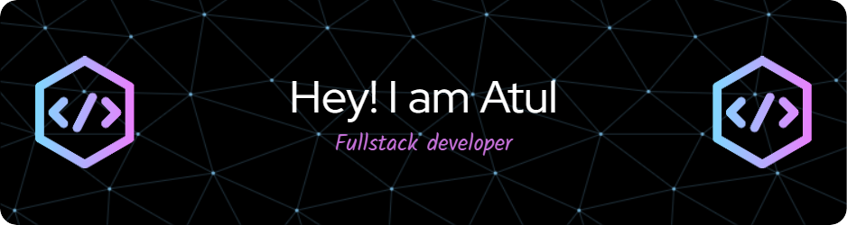

<!-- banner -->

<!-- tittle -->
<h1 align='center'> Hi! There 👋</h1>

<!-- Subtittle -->
<h2 align='center'>
I'm Atul.
</h2>
<h3 align='center'> AM Responsible for what i say .....💲not for what u understand 👑👑👑🎓</h3>
<h1 align='center'><i>Stay awesome!</i></h1>

<!-- FrontEnd -->
<!-- <h2 align="center">FrontEnd Tools</h2> -->

 
  <!-- Html -->
  
  <!-- hbd -->

   <!-- Css -->
 
  <!-- Sass -->
 
   <!-- Javascript -->
    
<!-- Babel -->
 
 <!-- Bootstrap -->
  
 <!-- ReatJS -->
  
 <!-- TailWindCss -->
  
   <!-- NodeJS -->
 
    <!-- Nodejs Dev -->
  
    <!-- Npm -->
  
    <!-- Yarn -->
  
  <!--Express  -->
  
<!-- Php -->
 
   <!-- MongoDB -->
    
   <!-- MySQL -->
   
<!-- Bash -->
  
   <!-- Linux -->
    
 <!-- Git -->
   
<!-- PostMan -->

<!-- Vs Code -->

 <!-- Docker -->
  
   <!-- Firebase -->
 
<!-- Netlify -->

<!-- Python -->
 
<!-- Oracle -->

<!-- Android Studio -->

<!-- AppWrite -->
 
<!-- Figma -->

<!-- nextjs -->

<!-- react native -->
  
<!-- redux -->

<!-- Django -->

<!-- GraphQl -->
 
<!-- PostgresSql -->
 
<!-- TypeScript -->

# 👾 i like these awesome Softwares
<!-- Software -->
- Software
  - Ram Cleaner Tool: [WinMemoryCleaner](https://github.com/IgorMundstein/WinMemoryCleaner) and [Pc Manager](https://www.microsoft.com/store/productId/9PM860492SZD?ocid=pdpshare) <!-- Ram Cleaner Tool -->
  - Assus Software: [armory create](https://www.asus.com/my/supportonly/armoury%20crate/helpdesk_download/) and [G-Helper](https://github.com/seerge/g-helper) <!-- Ram Assus  -->
  - Graphics Drivers: [Nvdia App](https://www.nvidia.com/en-in/software/nvidia-app/)<!-- Graphics Drivers  -->
  - Virtual Machines: [VMware Workstation Pro](https://github.com/atul-vhd/Softwares/releases/download/Vmware/VMware-workstation-full-17.6.1-24319023.exe) and [docker](https://www.docker.com/)
    - [WSL](https://learn.microsoft.com/en-us/windows/wsl/install-manual) 
    - [Debian](https://www.microsoft.com/store/productId/9MSVKQC78PK6?ocid=pdpshare) <!--virtual machines-->
  - Ms Office: [Ms office 365](https://github.com/Atugatran/Atugatran/releases/download/OfficeSetup/OfficeSetup.exe) and [Ms office with active](https://github.com/Atugatran/Atugatran/releases/tag/office2021_WithActivation) <!--Ms Office-->
  - Video to image extractor [ffmpeg](https://github.com/Atugatran/Atugatran/releases/download/ffmpeg/ffmpeg.msi) and [SheryExtract](https://github.com/Atugatran/Atugatran/releases/download/SheryExtract/SheryExtract.exe) <!--Video to image extractor-->
<!-- Coding Software -->
- Coding Software
    <!-- Code Editor -->
   - Code Editor: [vscode](https://code.visualstudio.com/)
      <!-- Fonts -->
      - Font: [fira code](https://github.com/Atugatran/Atugatran/releases/download/fira_code/Fira_Code_v6.2.zip)
   - Android Code Editor: [Android Studio](https://developer.android.com/studio?gclid=CjwKCAiA5L2tBhBTEiwAdSxJX6VyOXQrqQKu8Bs0i6Px9_ZSTWud1IuexyZcouvDEZHemBU3KgCTTxoC29kQAvD_BwE&gclsrc=aw.ds)
     - [Open JDK 17](https://learn.microsoft.com/en-us/java/openjdk/download)
   <!-- Version Control -->
   - Version Control : [git](https://git-scm.com/) and [github](https://github.com/)
   - Test API: [Postman](https://www.postman.com/downloads/) 
  
  
# 👨‍💻 when coding, i like these technologies:
###  Frontend
  - Basics:  [Html](https://html.com/), [Php](https://www.php.net/), [Css](https://www.w3schools.com/css/), [Js](https://www.javascript.com/), [Saas](https://sass-lang.com/), [Pug](https://pugjs.org/api/getting-started.html)
  - front-end framework: [Bootstrap](https://getbootstrap.com/) and [Tailwind](https://tailwindcss.com/) and [Typescript](https://www.typescriptlang.org/)
  - Liberies: [ReactJs](https://react.dev/), [tailblocks](https://tailblocks.cc/), [ReduxToolkit](https://redux-toolkit.js.org/) and [KaboomJs](https://kaboomjs.com/)
  - Component Library: [ui.shadcn](https://ui.shadcn.com/)
  - Syntax highlighter:  [syntax highlighting lib](https://prismjs.com/) 
  - Fonts: [google fonts](https://fonts.google.com/)
  - Icons: [fontawesome](https://fontawesome.com/)
  
### Animation Framework and Liberies
  - [AOS](https://michalsnik.github.io/aos/)
  - [AnimeJs](https://animejs.com/)
  - [ThreeJs](https://threejs.org/)
  - [Gsap](https://gsap.com/)
  - [Motion](https://motion.dev/)
  
###  Backend
  - [Node.js](https://nodejs.org/en/)  
    - [Express](https://expressjs.com/)
  - [NextJs](https://nextjs.org/)
  - [Python](https://python.org/)
    - [Django](https://www.djangoproject.com/)

### API 
  - [GraphQL](https://graphql.org/) 
###  Database
  - [MongoDb](https://www.mongodb.com/try/download/community)
  - [Redis](https://redis.io/) 
  - [Xampp](https://www.apachefriends.org/) 
  - [Wamp](https://wampserver.aviatechno.net/) 
  - [PostgreSql](https://www.postgresql.org/)
  - [AppWrite](https://appwrite.io/)

### RunTime Engine
  - JavaScript Engine For Web: [WebContainer](https://webcontainers.io/) 

### Deployment
  - [Cloudflare](https://www.cloudflare.com/) 
  - [Github Pages](https://pages.github.com/) 
  - [Render](https://render.com/) 
  - [Netlify](https://www.netlify.com/) 
  - [Alwaysdata](https://www.alwaysdata.com/en/)
  - [FireBase](https://firebase.google.com/)

### Design
  - [Figma](https://www.figma.com/)

### Android Development
- [React native](https://reactnative.dev/)
   - [reactnavigation](https://reactnavigation.org/)
   - [async-storage](https://react-native-async-storage.github.io/async-storage/)
   - [react-native-vector-icons](https://github.com/oblador/react-native-vector-icons)

