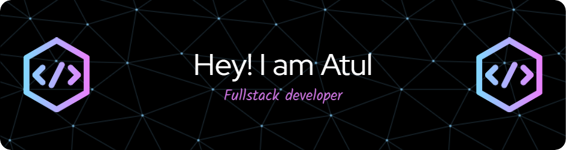

<div align="center">



# Hi there, I'm Atul 👋

<!-- Typing animation -->
<a href="https://github.com/atual-dev">
  
</a>

**I own what I say — not what you think it means. 👑🎓**

<i>Stay awesome!</i> ✨

<br />

<!-- Profile badges -->
[](https://github.com/atual-dev?tab=followers)
[](https://github.com/atual-dev)
[](https://github.com/atual-dev)

</div>

## 🧑‍💻 About Me

```yaml
name: Atul
role: Full-Stack Developer
currently_learning: [Next.js, React Native, System Design]
ask_me_about: [JavaScript, TypeScript, React, Node.js, Python]
fun_fact: "I turn ☕ into code"
```

---

## 🛠 Tech Stack

### Languages & Frontend

<div align="center">

<a href="https://skillicons.dev">
  
</a>

<sub>These are some of the tools I use for web and desktop work:<br />
**HTML · CSS · Sass · JavaScript · TypeScript · Babel · Pug · React · Next.js · Redux · Bootstrap · Tailwind · Electron · React Native**</sub>

</div>

### Backend, Data & Tools

<div align="center">

<a href="https://skillicons.dev">
  
</a>

<sub>Tools for servers, data, and everyday development:<br />
**Node.js · Express · PHP · Python · GraphQL · MongoDB · MySQL · PostgreSQL · Redis · Oracle · Docker · Git · Linux · Bash · Appwrite · Postman · Figma · Firebase · Netlify · VS Code**</sub>

</div>

---

## 🖥 My Favorite Software

### 💻 Everyday Essentials

- **Cleaner Tools** → [WinMemoryCleaner](https://github.com/Repocitories/WinMemoryCleaner), [PC Manager](https://apps.microsoft.com/detail/9pm860492szd?hl=en-US&gl=IN), [Kudo](https://github.com/AdventDevInc/kudu)
- **ASUS Software** → [Armoury Crate](https://www.asus.com/my/supportonly/armoury%20crate/helpdesk_download/), [G-Helper](https://github.com/seerge/g-helper)
- **Graphics Drivers** → [NVIDIA App](https://www.nvidia.com/en-in/software/nvidia-app/)

### 🕹 Virtualization & Gaming

- **Virtual Machines** → [VMware Workstation Pro](https://github.com/atulPersonal/Window/releases/download/VMware-workstation-full-17.6.4/VMware-workstation-full-17.6.4-24832109.exe), [Docker](https://www.docker.com/)
  - [WSL](https://learn.microsoft.com/en-us/windows/wsl/install-manual)
  - [Debian (Microsoft Store)](https://www.microsoft.com/store/productId=9MSVKQC78PK6?ocid=pdpshare)
- **Gaming Emulator** → [Ryujinx](https://github.com/atulPersonal/Ryujinx_Emulator)

### 📄 Media & Office

- **Office** → [MS Office 365](https://github.com/Atugatran/Atugatran/releases/download/OfficeSetup/OfficeSetup.exe), [MS Office 2021 (activated)](https://github.com/Atugatran/Atugatran/releases/tag/office2021_WithActivation)
- **Video → Image Extractor** → [FFmpeg](https://github.com/Atugatran/Atugatran/releases/download/ffmpeg/ffmpeg.msi), [SheryExtract](https://github.com/Atugatran/Atugatran/releases/download/SheryExtract/SheryExtract.exe)

### 📦 Coding Setup & Testing

- **Code Editor** → [VS Code](https://code.visualstudio.com/) — with the [Fira Code font](https://github.com/Atugatran/Atugatran/releases/download/fira_code/Fira_Code_v6.2.zip)
- **Version Control** → [Git](https://git-scm.com/), [GitHub](https://github.com/)
- **API Testing** → [Postman](https://www.postman.com/downloads/), [Requestly](https://requestly.com/)

---

## 🧰 Toolbox & Go-To Resources

### Frontend

| Category | Tools |
|---|---|
| **Basics** | [HTML](https://html.com/), [CSS](https://www.w3schools.com/css/), [JavaScript](https://www.javascript.com/), [PHP](https://www.php.net/), [Sass](https://sass-lang.com/), [Pug](https://pugjs.org/api/getting-started.html), [Handlebars](https://handlebarsjs.com/) |
| **Frameworks** | [Bootstrap](https://getbootstrap.com/), [Tailwind CSS](https://tailwindcss.com/), [TypeScript](https://www.typescriptlang.org/) |
| **Libraries** | [React](https://react.dev/), [Redux Toolkit](https://redux-toolkit.js.org/), [Tailblocks](https://tailblocks.cc/), [Kaboom.js](https://kaboomjs.com/) |
| **Animation** | [AOS](https://michalsnik.github.io/aos/), [Anime.js](https://animejs.com/), [Three.js](https://threejs.org/), [GSAP](https://gsap.com/), [Motion](https://motion.dev/) |
| **UI & Styling** | [shadcn/ui](https://ui.shadcn.com/), [Google Fonts](https://fonts.google.com/), [Font Awesome](https://fontawesome.com/), [Prism](https://prismjs.com/) for syntax highlighting |
| **Testing & QA** | [Jest](https://jestjs.io/), [React Doctor](https://www.react.doctor/) |
| **Desktop Apps** | [Electron](https://www.electronjs.org/) |

### Backend & Runtime

| Category | Tools |
|---|---|
| **Node.js** | [Node.js](https://nodejs.org/en/), [Express](https://expressjs.com/) |
| **Next.js** | [Next.js](https://nextjs.org/) |
| **Python** | [Python](https://python.org/), [FastAPI](https://fastapi.tiangolo.com/) |
| **PHP Runtime** | [XAMPP](https://www.apachefriends.org/), [WAMP](https://wampserver.aviatechno.net/) |
| **In-browser JS** | [WebContainers](https://webcontainers.io/) |

### Data, APIs & Deployment

| Category | Tools |
|---|---|
| **APIs** | [GraphQL](https://graphql.org/) |
| **Databases / BaaS** | [MongoDB](https://www.mongodb.com/try/download/community), [PostgreSQL](https://www.postgresql.org/), [MySQL](https://www.mysql.com/), [Redis](https://redis.io/), [Oracle](https://www.oracle.com/database/), [Appwrite](https://appwrite.io/) |
| **Deployment** | [Vercel](https://vercel.com/), [Netlify](https://www.netlify.com/), [Render](https://render.com/), [Cloudflare](https://www.cloudflare.com/), [GitHub Pages](https://pages.github.com/), [InfinityFree](https://www.infinityfree.com/) |

### 🤖 Coding AI Friends

- [Freebuff](https://freebuff.com/)

### 📱 Android Development

| Category | Tools |
|---|---|
| **IDE & JDK** | [Android Studio](https://developer.android.com/studio), [OpenJDK 17](https://learn.microsoft.com/en-us/java/openjdk/download) |
| **Framework** | [React Native](https://reactnative.dev/), [Expo](https://expo.dev/) |
| **App Testing** | [Expo Tools](https://docs.expo.dev/develop/tools/) |
| **Navigation** | [React Navigation](https://reactnavigation.org/) |
| **Storage** | [Async Storage](https://react-native-async-storage.github.io/async-storage/) |
| **Icons** | [react-native-vector-icons](https://github.com/oblador/react-native-vector-icons) |
